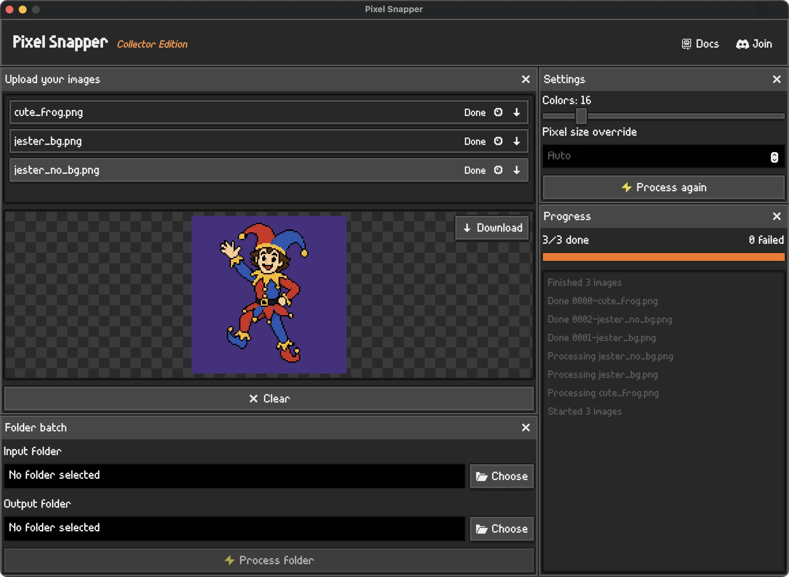

# Sprite Fusion Pixel Snapper

- **Online version**: https://spritefusion.com/pixel-snapper
- **Desktop version**: https://www.spritefusion.com/pixel-snapper#desktop-edition

A tool to snap pixels to a perfect grid. Designed to fix messy and inconsistent pixel art generated by AI.


## Why ?

**Current AI image models can't understand grid-based pixel art.**

- Pixel are inconsistent in size and position.
- The grid resolution can drift over time.
- Colors are not tied to a strict palette.

**With Pixel Snapper:**

- ✅ Pixel are snapped to a perfect grid.
- ✅ The grid resolution is consistent and can be scaled to pixel resolution.
- ✅ Colors are tied to a strict, quantized palette.

## Perfect for

- **AI generated pixel art** that needs to be snapped to a grid.
- **Procedural 2D art that doesn't fit a grid** like tilemaps or isometric maps.
- **2D game assets and 3D textures** that need to be perfectly scalable.


<p align="center"><em>Pixel Snapper preserves as much details as possible like dithering.</em></p>

<br>

## Desktop Application



A standalone build of Pixel Snapper coming with these features:
- Fast batch processing
- 100% offline desktop app
- One-time purchase, yours forever!
- Free lifetime updates
- Works on Mac, Linux, and Windows

[Download the desktop application](https://www.spritefusion.com/pixel-snapper#desktop-edition)

## Build from source

Requires [Rust](https://www.rust-lang.org/) installed on your machine.

### 💻 CLI

```bash
git clone https://github.com/Hugo-Dz/spritefusion-pixel-snapper.git
cd spritefusion-pixel-snapper
```

```bash
cargo run input.png output.png
```

The command accepts an optional k-colors argument:

```bash
cargo run input.png output.png 16
```

Use a directory as the input path to process a batch.

```bash
cargo run sprites/batch_inputs sprites/batch_outputs 16
```

You can also override the auto-detected pixel size with `--pixel-size`:

```bash
cargo run input.png output.png --pixel-size 8
cargo run sprites/batch_inputs sprites/batch_outputs 16 --pixel-size 8
```

This is useful when the auto-detection doesn't match the expected grid size. The value must be between 1 and half the smallest image dimension.

The k-means color selection is seeded, so results are reproducible by default. Pass `--seed` to roll a different set of representative colors — handy together with a color count or palette to explore variations:

```bash
cargo run input.png output.png 16 --seed 7
cargo run input.png output.png --palette pico8.hex 8 --seed 7
```

### 🎨 Custom palette

By default the colors are generated automatically with k-means. You can instead force a fixed palette with `--palette`. Without a color count, k-means is skipped and every pixel is snapped to its nearest palette color.

Pass the colors inline as a comma-separated list of hex values:

```bash
cargo run input.png output.png --palette "#1a1a2e,#16213e,0f3460,#e94560"
```

Or point at a [Lospec](https://lospec.com/palette-list) `.hex` file (one hex color per line):

```bash
cargo run input.png output.png --palette pico8.hex
cargo run sprites/batch_inputs sprites/batch_outputs --palette pico8.hex
```

Combine a palette with a color count to keep the palette's hues while limiting how many swatches are actually used. The image is first reduced to N colors with k-means, then each of those colors is snapped to the nearest palette entry — handy for large palettes like a 64-color set:

```bash
cargo run input.png output.png --palette resurrect-64.hex 16
```

Besides Lospec `.hex` files, GIMP `.gpl` and JASC `.pal` palettes work too, and you can even point `--palette` at an image (`.png` / `.jpg`) to extract its colors — when the image has more than 64 unique colors, the palette is reduced to 64 via k-means:

```bash
cargo run input.png output.png --palette retro.gpl
cargo run input.png output.png --palette some_reference_art.png
```

Add `--dither` to apply Floyd–Steinberg dithering against the effective palette (applied at output resolution, after the grid is resolved), which helps gradients survive small palettes:

```bash
cargo run input.png output.png --palette pico8.hex --dither
```

Notes:
- Palette matching is perceptual: colors are compared in OKLab, not raw RGB, so snapped colors match what your eye expects.
- The leading `#` is optional, and both 3-digit (`#abc`) and 6-digit (`#aabbcc`) forms are accepted.
- In a `.hex` file, blank lines and `;` comment lines are ignored.
- With a palette and no color count, all palette colors are available. With a color count, the output uses at most that many colors.
- Up to 256 colors. Works for both single-image and batch processing.

### 🌐 Web (WASM)

```bash
git clone https://github.com/Hugo-Dz/spritefusion-pixel-snapper.git
cd spritefusion-pixel-snapper
```

Build the WASM module into the web app folder:

```bash
wasm-pack build --target web --out-dir web/pkg --release
```

Then use the WASM module in your project:

```js
import init, { process_image, extract_palette } from "./pkg/spritefusion_pixel_snapper.js";

await init();

// process_image(inputBytes, kColors?, pixelSizeOverride?, paletteRgb?, seed?, dither?)
const outputBytes = process_image(inputBytes, 16);
```

Pass `undefined` (or `null`) for any optional argument you want to leave on its default behavior.

`paletteRgb` is an optional flat `Uint8Array` of RGB triplets (`[r, g, b, r, g, b, ...]`, max 256 colors). When given, pixels are snapped to that palette. Passing `kColors` alongside a palette switches to "reduce to N colors via k-means, then snap to the palette".

`seed` (optional, `u32`) re-seeds the k-means initialization. Different seeds discover different representative colors, so — when a color count is in play — the same image/palette yields different color combinations. It has no effect on the pure nearest-snap path (palette with no color count), which is deterministic by definition. Defaults to `42`.

`dither` (optional, `boolean`) applies Floyd–Steinberg dithering against the effective palette at output resolution. Defaults to `false`.

`extract_palette(inputBytes, maxColors?)` extracts a palette from an image: the unique opaque colors, reduced deterministically via k-means when there are more than `maxColors` (default 64, max 256). Returns a flat `Uint8Array` of RGB triplets, ready to feed into `process_image` as `paletteRgb`.

### 🖥️ Browser GUI

A minimal drag-and-drop GUI lives in `web/`. After building the WASM module (above), serve the folder over HTTP (ES modules + wasm can't load from `file://`):

```bash
cd web
python -m http.server 8000
# then open http://localhost:8000/
```

Drop an image, optionally supply a palette, toggle "Limit colors" with the slider, and compare the before/after preview before downloading the PNG.

The GUI's palette features:
- **Palette input** — paste hex colors into the textarea, or load a Lospec `.hex`, GIMP `.gpl`, or JASC `.pal` file. You can also load an image (`.png` / `.jpg`) to extract its palette (reduced to 64 colors via k-means when there are more).
- **Swatch ON/OFF curation** — every palette color appears as a swatch; click to toggle it on or off (the 使う色 counter tracks how many are active). The ON/OFF state survives textarea edits, and the enabled subset can be exported back to a `.hex` file.
- **Concept presets** — one-click filters that keep colors matching a concept: hue (暖色/寒色), lightness (明るい/暗い), saturation (鮮やか/くすみ), and color relationships (補色/類似/三色). Judgments run in OKLCh (perceptual hue/chroma/lightness); when a palette is entirely warm or entirely cool, 暖色/寒色 fall back to splitting it into its warmer and cooler halves. Relationship presets pivot around a base color: Shift+click a swatch to choose it (green outline), or let the most saturated color be picked automatically. すべてON re-enables everything.
- **Seed + 🎲** — re-roll the k-means colors to get different combinations. Enabled only while the seed actually matters ("Limit colors" on, or no palette); the pure nearest-snap path is deterministic.
- **Dither** — Floyd–Steinberg dithering against the active palette, applied at output resolution.
- **Previews** — before/after comparison plus a 1:1 actual-size view of the snapped result.

## Acknowledgments

Pixel Snapper is a [Sprite Fusion](https://spritefusion.com) project. Sprite Fusion is a free, web-based tilemap editor for game developers supporting a wide range of engines including Unity, Godot, Defold, and GB Studio.


## License

MIT License [Hugo Duprez](https://www.hugoduprez.com/)
