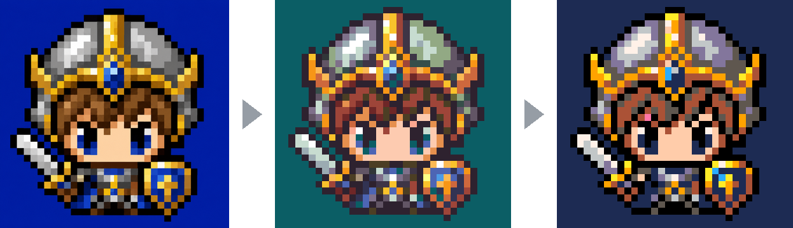
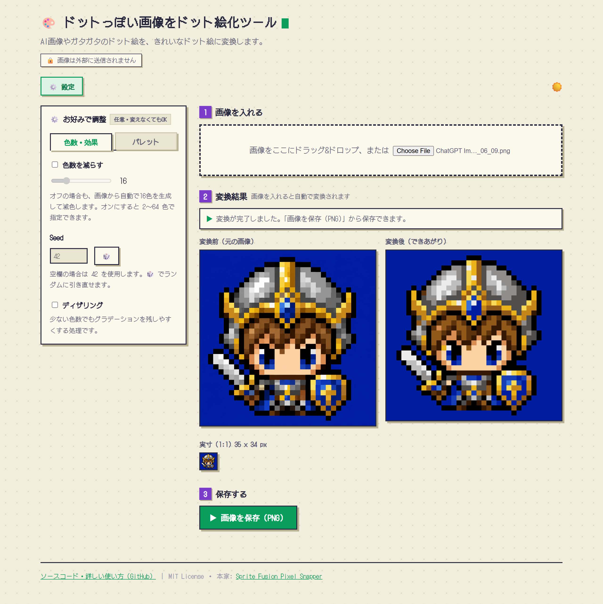

# Palette Pixel Snapper

**ガタガタなドット絵を、綺麗なグリッドに整え直して、好きなパレットで塗り直すツール。**

## 👉 今すぐブラウザで使う（インストール不要）

### **https://bamboo-b.github.io/palette-pixel-snapper/**

上のURLを開くだけ。**画像を入れて、ボタンを押して、保存するだけ**でドット絵が整います。
処理はぜんぶあなたのブラウザの中で行われるので、画像がどこかのサーバーに送られることはありません。



<p align="center"><em>左：AI生成の入力画像　→　中央：グリッドにスナップして整地　→　右：PICO-8パレットを適用</em></p>

---

## 何ができる？

AI生成のドット絵や、グリッドがズレてしまったドット絵を入力すると、

- ピクセルを**きっちり等間隔のグリッド**にスナップし直し、
- 色を**指定したパレット**（または自動生成パレット）に量子化して、

整った状態で出力します。

| 入力 | このツール | 出力 |
|------|-----------|------|
| AI生成やガタガタのドット絵 | グリッド自動検出 → スナップ | ピクセルが等間隔に整列 |
| バラバラな色 | パレット量子化（OKLab） | 指定した色だけで構成 |
| 大きい/ボケた画像 | ダウンサンプリング | 1ドット=1ピクセルの綺麗な結果 |

**向いている用途**：AI生成ドット絵の仕上げ / タイルマップやアイソメ絵の整地 / パレットを固定したい2Dゲームアセット。

> ⚠️ このツールは**後処理（仕上げ）専用**です。ゼロからドット絵を「生成」する機能はありません。既存の画像を整えるツールです。

---

## 使い方（ブラウザ版）



1. **画像をドラッグ&ドロップ**（またはファイル選択）
2. 「**ドット絵に整える**」ボタンを押す
3. before/after を見比べて、「**画像を保存（PNG）**」で書き出す

色を指定したい人は、画面の「**🎨 詳しい設定**」を開くと、パレットの貼り付け・ファイル読み込み・色数の調整・ディザリングなどが使えます（使わなくてもOK）。

---

<details>
<summary><b>🛠 開発者向け：ローカルビルド / CLI / WASM API</b>（クリックで開く）</summary>

## セットアップ

[Rust](https://www.rust-lang.org/) が必要です。ブラウザGUIをローカルでビルドする場合は [`wasm-pack`](https://rustwasm.github.io/wasm-pack/) も必要です。

```bash
git clone https://github.com/bamboo-b/palette-pixel-snapper.git
cd palette-pixel-snapper
```

> 公開版（上記URL）は `main` への push ごとに GitHub Actions が自動ビルド・デプロイしています（`.github/workflows/deploy.yml`）。

### ブラウザGUIをローカルで動かす

WASMをビルドしてから、`web/` フォルダをHTTPで配信します（ESモジュール＋wasmは `file://` から読めないため）。

```bash
# 1. WASMをビルド
wasm-pack build --target web --out-dir web/pkg --release

# 2. web/ を配信
cd web
python -m http.server 8000
# → ブラウザで http://localhost:8000/ を開く
```

---

## CLI

### 基本

```bash
# 色数はデフォルト16
cargo run input.png output.png

# 色数を指定（第3引数 = k）
cargo run input.png output.png 16

# ディレクトリを渡すとバッチ処理（rayonで並列）
cargo run sprites/batch_inputs sprites/batch_outputs 16
```

### グリッドサイズを手動指定

自動検出が期待とズレるときは `--pixel-size` で上書き（1〜画像短辺の半分の範囲）。

```bash
cargo run input.png output.png --pixel-size 8
cargo run sprites/batch_inputs sprites/batch_outputs 16 --pixel-size 8
```

### バリエーションを試す（seed）

k-meansはシード固定なのでデフォルトは毎回同じ結果。`--seed` で代表色の引き直しができます（色数やパレットと併用時に効く）。

```bash
cargo run input.png output.png 16 --seed 7
cargo run input.png output.png --palette pico8.hex 8 --seed 7
```

## パレットを適用する（CLI）

`--palette` で固定パレットを強制します。**色数を付けない**とk-meansをスキップし、全ピクセルを最も近いパレット色にスナップします。

```bash
# インラインでhexをカンマ区切り指定（# は省略可）
cargo run input.png output.png --palette "#1a1a2e,#16213e,0f3460,#e94560"

# Lospec .hex ファイル（1行1色）
cargo run input.png output.png --palette pico8.hex
cargo run sprites/batch_inputs sprites/batch_outputs --palette pico8.hex
```

**パレット＋色数の併用**：まず画像をk-meansでN色に減らし、その各色をパレットの最も近い色にスナップします。大きなパレット（例：64色）から自然な色味を保ちつつ色数を絞りたいときに便利。

```bash
cargo run input.png output.png --palette resurrect-64.hex 16
```

**対応フォーマット**：Lospec `.hex` に加え、GIMP `.gpl` / JASC `.pal`、さらに**画像**（`.png` / `.jpg`）を渡すとその色を抽出（65色以上なら64色にk-means縮小）。

```bash
cargo run input.png output.png --palette retro.gpl
cargo run input.png output.png --palette some_reference_art.png
```

**ディザリング**：`--dither` でFloyd–Steinbergディザを適用（グリッド確定後、出力解像度で適用）。少ない色数でもグラデーションを残しやすくなります。

```bash
cargo run input.png output.png --palette pico8.hex --dither
```

補足：

- 色マッチングは**知覚的**：sRGBの生の距離ではなく **OKLab** 空間で比較するので、見た目に近い色に揃います。
- `#` は省略可、3桁（`#abc`）・6桁（`#aabbcc`）どちらもOK。
- `.hex` ファイル内の空行と `;` コメント行は無視されます。
- パレット指定＋色数なし＝全パレット色が使用可能。色数ありだと最大その色数まで。
- 最大256色。単一画像・バッチ両対応。

## WASM API

ビルド後、生成モジュールを読み込んで使います。

```js
import init, { process_image, extract_palette } from "./pkg/spritefusion_pixel_snapper.js";

await init();

// process_image(inputBytes, kColors?, pixelSizeOverride?, paletteRgb?, seed?, dither?)
const outputBytes = process_image(inputBytes, 16);
```

- 使わない省略可能引数には `undefined`（または `null`）を渡します。
- `paletteRgb`：RGB三つ組をフラットに並べた `Uint8Array`（`[r,g,b, r,g,b, ...]`、最大256色）。渡すとそのパレットにスナップ。`kColors` を併用すると「k-meansでN色に減らしてからパレットにスナップ」に切り替わります。
- `seed`（`u32`、省略可）：k-means初期化のシード。色数が絡む場合、同じ画像/パレットでも別の色の組み合わせになります。純粋な最近傍スナップには影響しません。デフォルト `42`。
- `dither`（`boolean`、省略可）：出力解像度でFloyd–Steinbergディザを適用。デフォルト `false`。
- `extract_palette(inputBytes, maxColors?)`：画像からパレットを抽出（不透明な一意色を、`maxColors` 超なら決定論的にk-means縮小。デフォルト64・最大256）。`process_image` の `paletteRgb` にそのまま渡せる `Uint8Array` を返します。

## パラメータ早見表（CLI）

| 引数 | 意味 | 例 |
|------|------|-----|
| `<input>` | 入力画像 or ディレクトリ（必須） | `in.png` |
| `<output>` | 出力先（必須） | `out.png` |
| `[k]` | 色数（位置引数・省略時16） | `16` |
| `--pixel-size <n>` | グリッド間隔を手動指定 | `--pixel-size 8` |
| `--palette <値>` | 固定パレット（インラインhex / `.hex` / `.gpl` / `.pal` / 画像） | `--palette pico8.hex` |
| `--seed <n>` | k-meansのシード | `--seed 7` |
| `--dither` | Floyd–Steinbergディザ適用 | `--dither` |

</details>

---

## このツールについて

[Hugo Duprez](https://www.hugoduprez.com/) 氏の [Sprite Fusion Pixel Snapper](https://github.com/Hugo-Dz/spritefusion-pixel-snapper) の**フォーク**です。本家の「グリッドスナップ」機能に、**任意パレットの適用**（`.hex` / `.gpl` / `.pal` / 画像からの抽出、OKLabによる知覚的な色マッチング、ディザリング、パレット編集GUI）を追加しています。

Sprite Fusion は Unity・Godot・Defold・GB Studio など多くのエンジンに対応した、無料のWebベース・タイルマップエディタです。本家ツール（ホスティング版・有料デスクトップ版を含む）は [spritefusion.com/pixel-snapper](https://www.spritefusion.com/pixel-snapper) にあります。


## ライセンス

MIT License — [Hugo Duprez](https://www.hugoduprez.com/)
